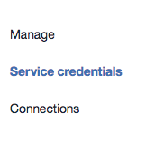

# Scrape, Analyze and Visualize insights on Startups using Watson Studio

This Code Pattern provides a tool that extracts live unstructured data about Startups in a particular Industry and their impact in the industry with the help of Watson Natural Language Understanding, fed into IBM SPSS Predictive Analytics to get meaningful insights and predictions, finally fed into Cognos Dashboard which provides insights and visualisation from the provided input.


When the reader has completed this Code Pattern, they will understand how to:

* Create and Run a Python Notebook on Watson Studio.
* Scrape data using BeautifulSoup.
* Use Watson Natural Language Understanding to extract metadata from Python Notebook.
* Generate a csv and Convert to a Table in DB2 Warehouse.
* Load and analyze data in SPSS Modeler.
* Load and Visualize data in Cognos Dashboard.


<!--add an image in this path-->


<!--Optionally, add flow steps based on the architecture diagram-->
## Flow

1. The user creates and runs a Python Notebook on Watson Studio.
2. The Notebook scrapes latest news on Startups.
3. The Scraped Information is sent to Watson Natural Language Understanding to extract Keywords, Entities, Sentiments and its respective confidence scores.
4. The Results of NLU are compiled into a csv file which is further converted to a table in DB2 Warehouse.
5. The table created is ingested in SPSS to do some analytics and return a score against each company. The updated table is then saved back to DB2 Warehouse.
6. Finally, Cognos ingests, the final table generated in DB2 Warehouse giving insightful visualisation.

<!--Optionally, update this section when the video is created-->
# Watch the Video

Insert Video

# Steps

1. [Sign up for IBM Watson Studio](#1-sign-up-for-ibm-watson-studio)
2. [Create Watson services with IBM Cloud](#2-create-watson-services-with-ibm-cloud)
3. [Create a Project on Watson Studio](#3-create-a-project-on-watson-studio)
4. [Configure credentials](#5-configure-credentials)
5. [Run the application](#6-run-the-application)

## 1. Sign up for IBM Watson Studio

Once you have created an IBM Cloud Account, navigate to [Watson Studio](https://console.bluemix.net/catalog/services/watson-studio) service and click on the `Create` button.

By signing up for IBM Watson Studio, two additional services will be created - ``Spark`` and ``ObjectStore`` in your [IBM Cloud dashboard](https://console.bluemix.net/dashboard/apps).

### 2. Create Watson services with IBM Cloud

Create the following services:

* [**Watson Natural Language Understanding**](https://console.ng.bluemix.net/catalog/services/natural-language-understanding)
* [**DB2 Warehouse**](https://console.bluemix.net/catalog/services/db2-warehouse)
* [**Object Storage **](https://console.bluemix.net/catalog/services/cloud-object-storage)

### 3. Create a Project on Watson Studio

* Login to [IBM Cloud Dashboard](http://console.bluemix.net/).
* Click on the Watson Studio instance that was created earlier.
* Click `Get Started` button at the bottom of the page.


* Select the `New Project` option from the Watson Studio landing page and choose the `Standard` option.


* To create a project in Watson Studio, give the project a name and select the Cloud Object Storage service created.


* Upon a successful project creation, you are taken to a dashboard view of your project. Take note of the `Assets` and `Settings` tabs, we'll be using them to associate our project with any external assets (datasets and notebooks) and any IBM cloud services.


### Create a Notebook

* Click on the `Add to project` tab and select `Notebook`.


* Click on the `From URL` tab and enter the notebook url from the repo- `Insert Link`


* Select the free runtime.
* Click the `create` button.


### Create a Modeler

* Click on the `Add to project` tab and select `Modeler Flow`.


* Navigate to the Modeler file - `Modeler/Analyze_Startup_Data.str` and download the file.

* Navigate to `From File` tab and upload the downloaded `Analyze_Startup_Data.str` file.


* Click the `create` button.

### Create a Dashboard
```
COGNOS PORTION
```
### 4. Configure credentials

1. [Add the Natural Language Understanding service credentials](#1-add-the-natural-language-understanding-service-ccredentials)
2. [Add the DB2 Warehouse service credentials](#1-add-the-db2-warehouse-service-credentials)

#### 1. Add the Natural Language Understanding service credentials

* Open the Watson Natural Language Understanding service in your [IBM Cloud Dashboard](https://console.bluemix.net/dashboard/apps) and
Once the service is open copy the `apikey` and `url` in the `Credentials` menu.

* Select the cell below `2.1 Add your service credentials from IBM Natural Language Understanding service` section in the notebook to update the credentials for Watson Natural Langauage Understanding.


* Update the `apikey` and `url` key values in the cell below `2.1 Add your service credentials from IBM Cloud for the Watson services` section.


#### 2. Add the DB2 Warehouse service credentials

* Open the DB2 Warehouse service in your [IBM Cloud Dashboard](https://console.bluemix.net/dashboard/apps).
* Click on `Service Credentials` from the options given on the left.



* Click on `View credentials` and copy the credentials.
* In the notebook, scroll to `2.2 Add your service credentials for DB2` and paste the copied credentials in the variable `credentials_1_DB2`.


