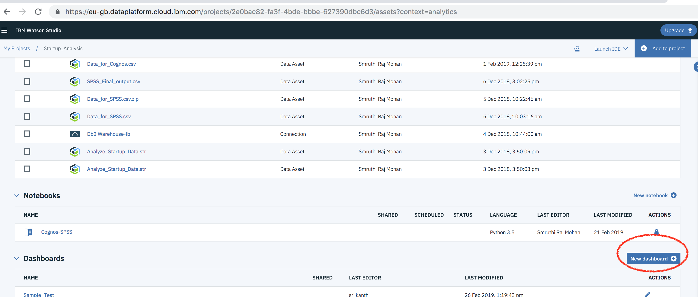
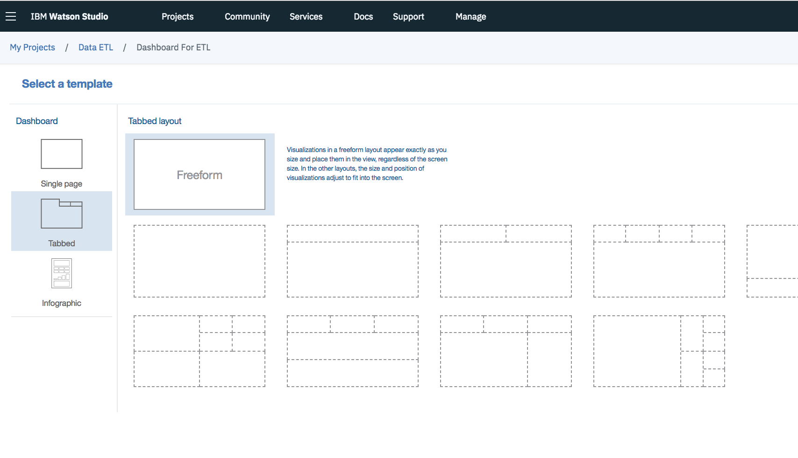
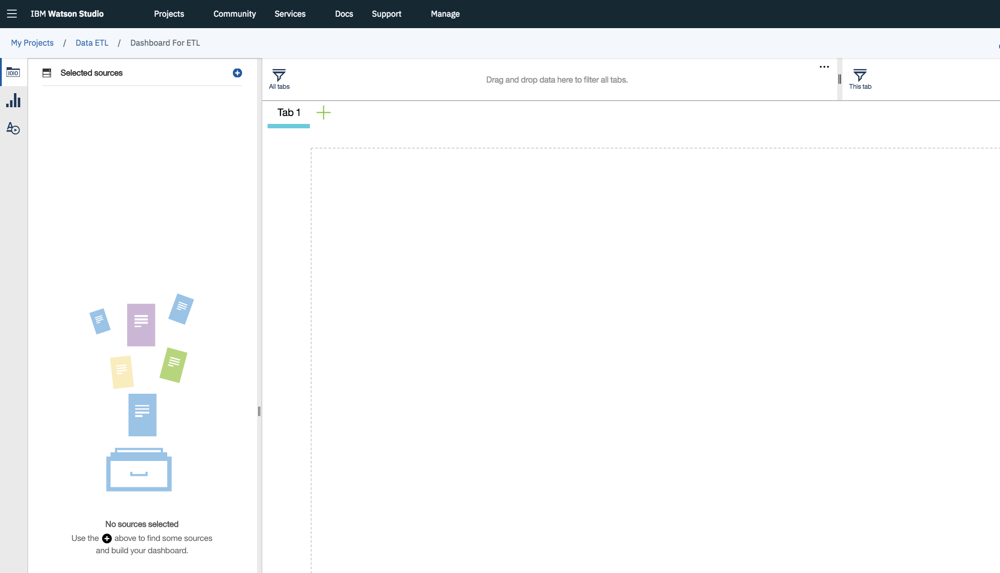
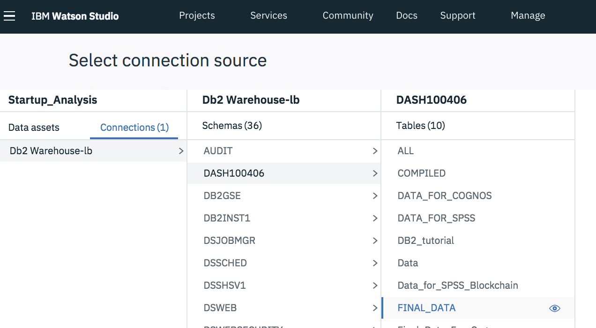
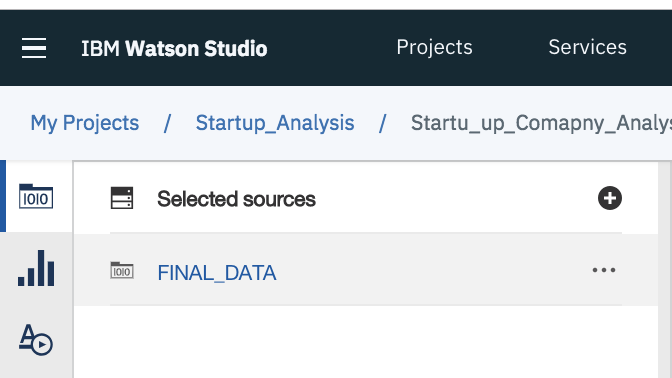
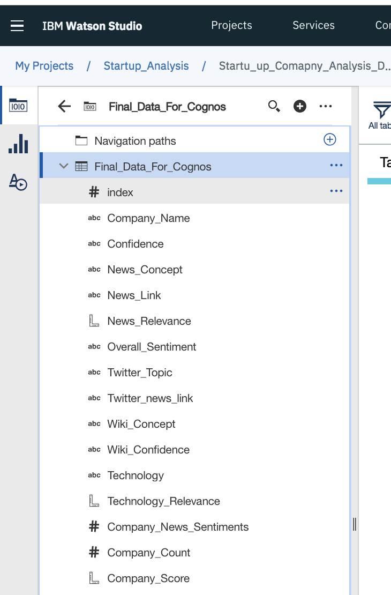
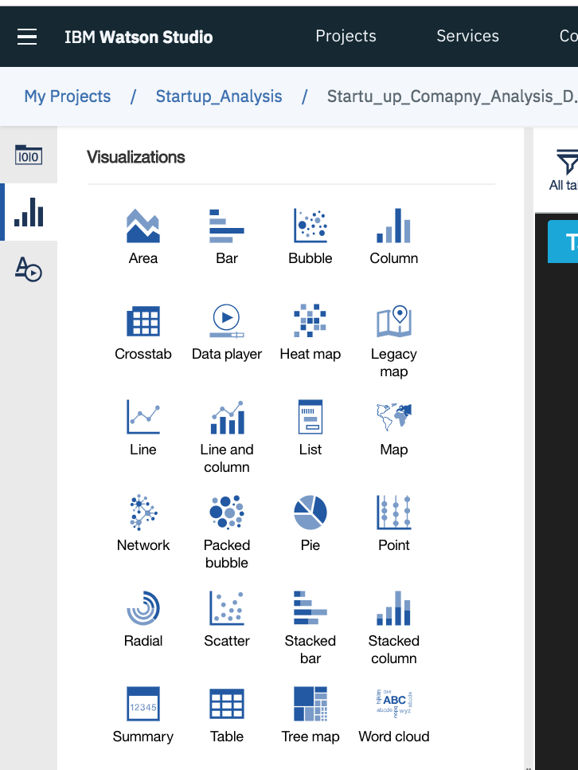
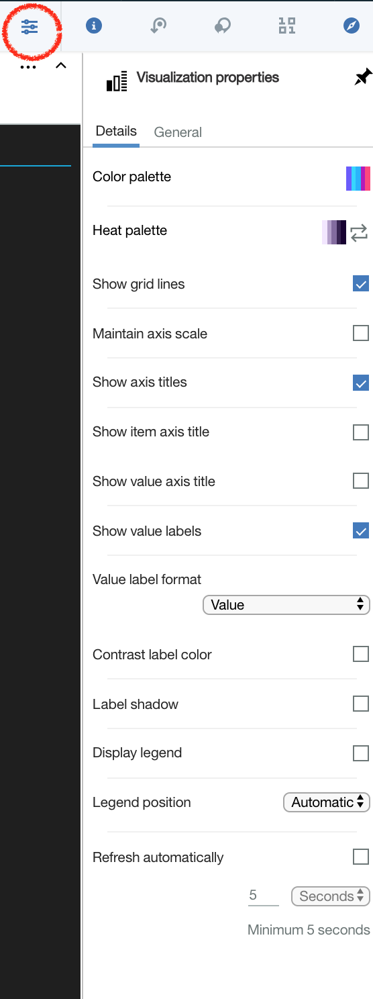

# Startup Company analysis Dashboard 

Startup analysis Dashboard provides user a complete Insights and showcases the Predicted information in the form of charts/widgets using IBM Watson Embedded Dashboard Service which hosted on Watson Studio. 
You can build sophisticated visualizations of your analytics results, communicate the insights that you've discovered in your data on the dashboard and then share the dashboard with others.

#### Key Features of IBM Cognos Dashboard Embedded are as follows:

- Live connection to underlying data
- Interactive dashboards produce visualizations directly from your data in real-time.
- Smart creation of visualizations
- Smart data analysis and visualization capabilities help users discover underlying patterns and meanings in their data.
- Interactive exploration of data
- Data can be explored using filtering and navigation paths.
- Embedded in your application
- Because dashboards are fully embedded, dashboards are integrated into your application's context, keeping users engaged.

In this pattern we have used this service to consume the derived insights (from db2 warehouse) followed by interactive dashboards which produces visualizations directly from your data in real-time.

User can create and visulaize the data in the form of 4 widgets as follows:

1. Company's Score based on Relevance
2. Total number of articles appeared in the web of a Company
3. News Concept Relevance
4. News Sentiment Analysis by Company

## Steps to create the Dashboard 

### (i) Provisioning a Dashboard Embedded analytics service Instance to the Watson Studio Project

* Click on `Add to Project` button to add the Embedded Dashboard Analytics service.

### (ii) Create a New Dashboard by importing `Starup_Analytics_Dashboard.json` file.

*  Click on New Dashboard under Dashboard asset. See screenshot for details.

* Select the Template for your Dashboard.

* Click on selected sources `+` button to connect to the DB2 Warehouse.

* Connect to the DB2 Warehouse database (DASH100406) and then select the `Final_Data` as a data source. See below screenshot for details.

* After connecting to the DB2 Warehouse database, you will see `Final_Data` as a new datasource under the Selected Sources.

* Click on `Final_Data` data source and now you can see the column names displayed vertically under `Final_Data`. These columns can be used for dashboard as a source. 

### (iii) Creating the Dashboard

Following are the Four widgets that can be created:

1. Company's Score based on Relevance
2. Total number of articles appeared in the web of a Company
3. News Concept Relevance
4. News Sentiment Analysis by Company

#### 1. Company's Score based on Relevance
This widget gives you the insights of the company's score based on the relevance score that is been predicted by the SPSS model.

* Firstly, click on Visualizations tab and double click on the Word Cloud Chart. 

* Now, add the data items such as `Company Name, Company Score` and again `Company name` in the color field of the chart as per the below screen shot. Then minimize the widget and adjust the widget length and width as per your requirement.

* Optionally, you have various changes that you can perform based on your requirements. Select the chart and click on Properties icon for any changes. See screen shot for details.

2. Total number of articles appeared in the web of a Company
